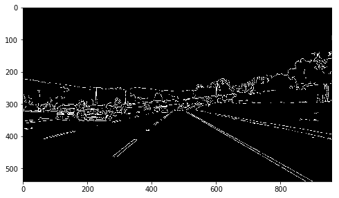

# A1 - Finding Lane Lines on the road.

## Introduction
    
This project aim at looking for the lane lines on the road. To achieve this target, first I make a pipe line and tested on static images. Then optimize this on the videos.
    
## Pipelines

In the pipeline paragraph, the following picture is taken as an example.


### Import packages

```python
    import matplotlib.pyplot as plt
    import matplotlib.image as mpimg
    import numpy as np
    import cv2
    %matplotlib inline
```

### Grayscale

```python
    def grayscale(img):
        return cv2.cvtColor(img, cv2.COLOR_RGB2GRAY)
    plt.imshow(grayscale(image), cmap='gray')
```


The grayscale image is easy for us to find bright and dark points. In order to determine **edges** in the picture, an OpenCV library **Canny** is used.

### Canny Edge Detection

By choosing the low threshold 60 and the high threshold 146, with the canny method, the grayscale picture will be converted to the following canny edge picture.

```python
    def canny(img, low_threshold, high_threshold):
        return cv2.Canny(img, low_threshold, high_threshold)
    low_threshold = 60
    high_threshold = 146
    edge_image = canny(image, low_threshold, high_threshold)
    plt.figure(figsize=(8,6))
    plt.imshow(edge_image, cmap='Greys_r')
```



### Hough Transform for the whole pictures

Convert the image-space data into hough space (with rho and theta). By defining the following parameters, the picture after hough transformation is given.

```python
    def hough_lines(img, rho, theta, threshold, min_line_len, max_line_gap):
    
        lines = cv2.HoughLinesP(img, rho, theta, threshold, np.array([]), minLineLength=min_line_len, maxLineGap=max_line_gap)
        line_img = np.zeros((img.shape[0], img.shape[1], 3), dtype=np.uint8)
        draw_lines(line_img, lines)
        return line_img


    rho = 1
    theta = np.pi/180
    threshold = 15 # grid size in the output
    min_line_length = 20 # minimum line length in the output
    max_line_gap = 50    # max distance allowed to be connected in one line
    line_image = hough_lines(edge_image, rho, theta, threshold, min_line_length, max_line_gap)
    plt.figure(figsize=(8,6))
    plt.imshow(line_image)
```


### Region of Interest

Defining a polygon and make the rest of image black.

```python
    height = image.shape[0]
    width = image.shape[1]
    vertices = np.array([[(0,height),(width*2/5, height*3/5), 
                          (width*3/5, height*3/5), (width,height)]], dtype=np.int32)
    edge_image_masked = region_of_interest(edge_image, vertices)
    line_image_masked = hough_lines(edge_image_masked, rho, theta, threshold, min_line_length, max_line_gap)
```

A roughly detection is given. 


### Optimization

The rest of the redundant lines could be optimized(eliminated) by taking the following steps:

- In the drawline function, convert the image space coordinates to the hough space.
- filter the point by slope m


```python
    left = np.array([(np.nan, np.nan)])
    right = np.array([(np.nan, np.nan)])
    
    for line in lines:
       for x1,y1,x2,y2 in line:
            # Protect against "divided by zero"
            if(abs(x2 - x1) < 1e-3):
                continue
            # Hough Transformation
            m = (y2 - y1) / (x2 - x1)
            b = y2 - m * x2
            # not nan
            if (math.isnan(m) or math.isnan(b)):
                continue
            
            # Hough space we can define the range of m
            if(m <= -0.55 and m >= -0.85):
                # cv2.line(img, (x1, y1), (x2, y2), [255, 0, 0], thickness)
                left = np.append(left, [(m, b)], axis=0)
            elif(m >= 0.55 and m <= 0.85):
                # cv2.line(img, (x1, y1), (x2, y2), [255, 0, 0], thickness)
                right = np.append(right, [(m, b)], axis=0)
```


- take the average position of the rest lines as the final output

```python
    # Take the average of m and b
    # Draw the lines.
    if (len(left) > 0): 
        avg_left = np.nanmean(left, axis=0)
        # print(avg_left[0], avg_left[1])
        left_x_min =  (img.shape[0]*3/5 - avg_left[1]) / avg_left[0]
        left_x_max =  (img.shape[0] - avg_left[1]) / avg_left[0]
        if (not math.isnan(left_x_min) and not math.isnan(left_x_max)):
            cv2.line(img, (int(left_x_min), int(img.shape[0]*3/5)), (int(left_x_max), img.shape[0]), [0, 0, 255], thickness)
    
    if (len(right) > 0):
        avg_right = np.nanmean(right, axis=0)
        right_x_min =  (img.shape[0]*3/5 - avg_right[1]) / avg_right[0]
        right_x_max =  (img.shape[0] - avg_right[1]) / avg_right[0]
        if (not math.isnan(right_x_min) and not math.isnan(right_x_max)):
            cv2.line(img, (int(right_x_min), int(img.shape[0]*3/5)), (int(right_x_max), img.shape[0]), color, thickness)
```          
 
 
 ### Weighted Image
 
 Add the lines on the picture.
 
 ```python
    line_edges = weighted_img(line_image_masked, image)
    plt.figure(figsize=(8,6))
    plt.imshow(line_edges)
```

 
 
 ## Shortcomings
 
 - Limited straight lines，Not good for the curve. 
 - Currently only judged by the slope, the drawing average method is simple but rough.
 
 ## Improvements
 
 A possible improvement could be using a temporal curve fitting  for the drawing functions, which may minimize the difference per frame. 